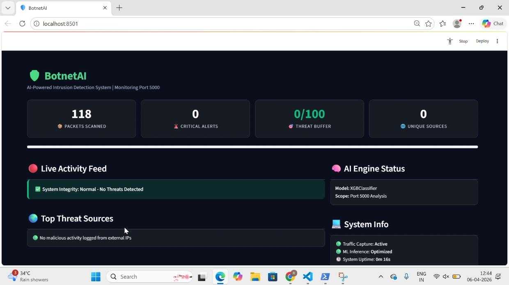
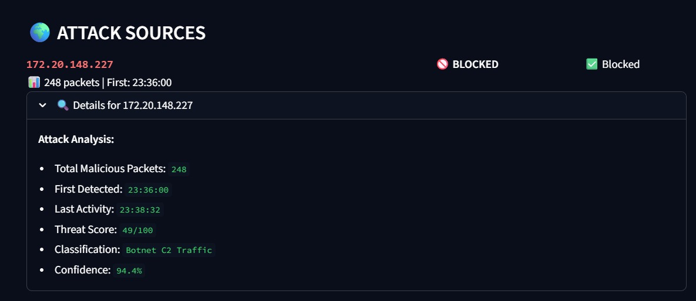
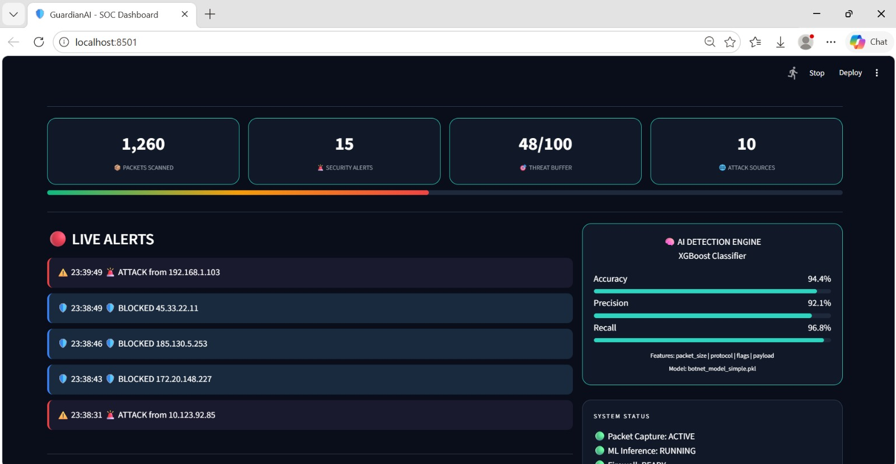
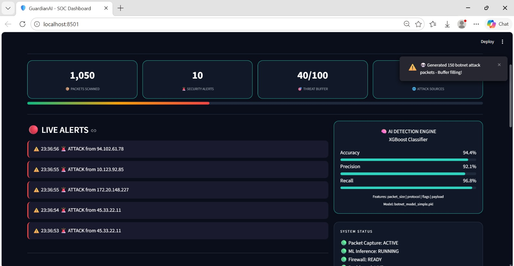
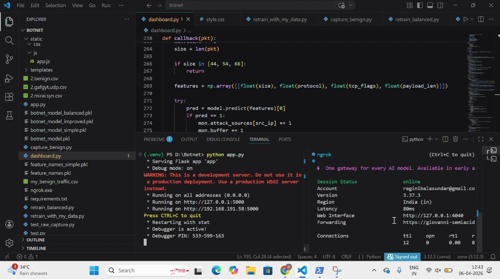

# AI-Based Botnet Detection Using Network Flow Data

### 🛡️AI-Shield: Real-Time Explainable Botnet Detection System

---

## 📌 Overview

This project presents a **real-time AI-based system** for detecting botnet attacks using network flow data.
It monitors incoming traffic, classifies it as **benign or malicious**, and provides **explainable insights** into the decision using SHAP.

---

## 🎯 Problem Statement

Academic portals (like VTOP) often face heavy traffic during peak times.
Traditional systems cannot effectively distinguish between:

* Legitimate users (students)
* Malicious botnet traffic (DDoS attacks)

This leads to:

* Server crashes
* Poor user experience
* False blocking of real users

---

## 💡 Proposed Solution

AI-Shield acts as an intelligent security layer that:

* Captures live network traffic
* Extracts flow-based features
* Uses machine learning to detect attacks
* Explains decisions using Explainable AI (SHAP)
* Displays results in a real-time dashboard

---

## 🏗️ System Architecture

User / Attacker
↓
Flask Web Application (VTOP Clone)
↓
Packet Sniffer (Scapy)
↓
Feature Extraction
↓
ML Model (XGBoost)
↓
SHAP Explainability
↓
Streamlit Dashboard

---

## ⚙️ Tech Stack

* **Backend:** Python (Flask)
* **Frontend:** HTML, CSS, JavaScript
* **Sniffer:** Scapy
* **Machine Learning:** XGBoost
* **Explainability:** SHAP
* **Dashboard:** Streamlit
* **Dataset:** N-BaIoT, Bot-IoT

---

## 🚀 Key Features

* 🔍 Real-time network traffic monitoring
* 🤖 AI-based botnet detection
* ⚡ Fast attack detection
* 📊 Interactive dashboard visualization
* 🧠 Explainable AI (SHAP insights)
* 🛡️ Simulated DDoS attack detection

---

## 📸 Screenshots

### 🟢 Normal Traffic (Benign)

System operating under normal conditions with stable traffic.



---

### 🔴 Botnet Attack Detected

High packet rate detected. System flags malicious traffic.





---

### 💻 System Implementation

Backend and application running in development environment.



---

## 🎥 Demo Video

[Watch Demo Video](https://drive.google.com/file/d/1F-udr9hovMkUrIqWHj40HfoA8c3Knh6J/view?usp=sharing)

## 🧪 Experimental Setup

* **PC 1:** Attacker system (simulated botnet traffic)
* **PC 2:** Server + detection system
* **Mobile Device:** Accessing web application

---

## 📥 Dataset & Model

Due to GitHub size limitations, the following files are not included:

* Dataset files (.csv)
* Trained model files (.pkl)

👉 These can be added manually or retrained using provided scripts.

---

## 🛠️ Installation & Setup

```bash
git clone https://github.com/sovi75/Ai_Botnet_Detector.git
cd Ai_Botnet_Detector
pip install -r requirements.txt
python app.py
```

---

## 📊 Results

* High detection accuracy on IoT botnet datasets
* Clear distinction between normal and attack traffic
* Fast response time for detection

---

## ⚠️ Note

Large files such as datasets and trained models are excluded due to GitHub size limits.

---

## 🔮 Future Enhancements

* Automated IP blocking (firewall integration)
* Deep packet inspection
* Cloud deployment
* Enhanced UI/UX

---

## 👩‍💻 Authors

- **Ragini Balasundaram** – 24BYB1115  
- **R Jerusha** – 24BYB1173  
- **S Oviya** – 24BYB1105

---
